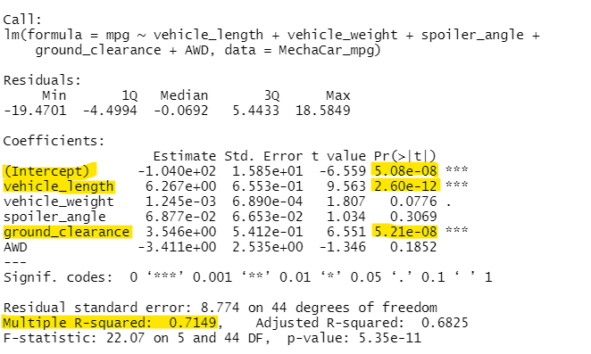
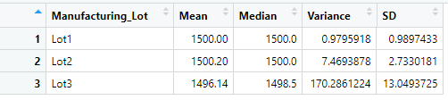
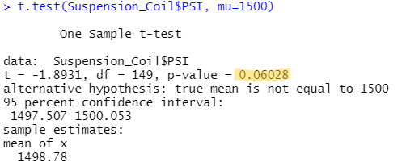
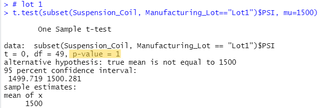
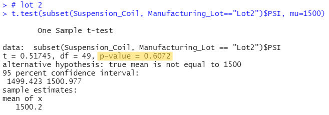
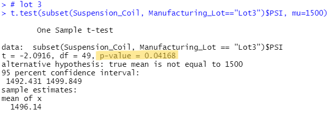

# MechaCar_Statistical_Analysis

## Background

 

This is a project to determine a way of predicting MPG designed to assist the company MechaCar using R and R-Studio. The project is broken down into four sections:

	1. Linear Regression to Predict MPG
	2. Summary Statistics on Suspension Coils
	3. T-Test on Suspension Coils
	4. Design a Study Comparing the MechaCar to the Competition

 

## Linear Regression to Predict MPG
	
	* Perform multiple linear regression analysis to identify which variables in the dataset predict the 	mpg of MechaCar prototypes.

	

	* Question 1: Which variables/coefficients provide a non-random amount of variance to the mpg values 	in the dataset?

	- Methodology: Review the Pr(>|t|) value in the summary above represents the probability that each 	coefficient contributes a random amount of variance to the linear model

	- Answer: **The car's length and ground clearance have a significant impact on mpg.**

	* Question 2: Is the slope of the linear model considered to be zero? Why or why not?
	
	- Methodology: Examine the P-value in the summary above to see if the intercept is statistically 	significant.

	- Answer: **As the intercept is statistically significant and not zero, it indicates that the 	intercept explains a significant amount of variability in the dependent variable when all independent 	varaiables are set to zero.** This could mean two possible things, either significant features may 	need scaling or transforming to help improve the predictive power of the model or that there are other 	variables that can help explain the variability of the independent variable that are missing from the 	data.

	 * Question 3: Does this linear model predict mpg of MechaCar prototypes effectively? Why or why not?

	- Methodology: Review the muliple R-squared value to indicate how well the regression model 	approximates the data points.The value should be between 0 and 1 and should be able to predict future 	data points well.

	- Answer: **As the mulitple R-squared value is 0.71 and the p-value is significant this model does a 	good job of predicting mpg.**

## Summary Statistics on Suspension Coils
	* Collect summary statistics on the pounds per square inch (PSI) of the suspension coils from the 	manufacturing lots

	

	

	* The design specifications for the MechaCar suspension coils dictate that the variance of the 	suspension coils must not exceed 100 pounds per square inch. Does the current manufacturing data meet 	this design specification for all manufacturing lots in total and each lot individually? Why or why 	not?

	- Methodology: Using group_by, we summarize the mean, median, variance and standard deviation. We use 	the variance to determine PSIs for the three lots to determine that which if any is over 100 PSI.

	- Answer: **In total all lots meet the 100 PSI or less specification with an average PSI of about 62. 	However, while lots 1 and 2 individually met the PSI variance requirements lot 3 exceeded the variance 	requirements at 170 PSI.**

## T-Test on Suspension Coils
	* Run t-tests to determine if the manufacturing lots are statistically different from the mean 	population

	 

	

	 

	- Overall, Mechacar suspension coils p-values are over 0.05 and we therefore do not have sufficient 	evidence to reject the null hypothesis. See results above.

	 

	

	

	- The results of the t-tests for lots 1 and 2 were the same as the overall p-value as each has a 	higher p-value (1.00 and 0.61, respectively) and we therefore do not have enough evidence to reject 	the null hypothesis in these cases either.

	

	However, the t-test results for lot 3 determine that there is enough evidence to reject the null 	hypothesis as it has a p-value of 0.04.

## Study Design: MechaCar vs Competition
	* Design a statistical study to compare vehicle performance of the MechaCar vehicles against vehicles 	from other manufacturers. For each statistical analysis, you’ll write a summary interpretation of the 	findings.

Write a short description of a statistical study that can quantify how the MechaCar performs against the competition. In your study design, think critically about what metrics would be of interest to a consumer: for a few examples, cost, city or highway fuel efficiency, horse power, maintenance cost, or safety rating.
In your description, address the following questions:
What metric or metrics are you going to test?
What is the null hypothesis or alternative hypothesis?
What statistical test would you use to test the hypothesis? And why?
What data is needed to run the statistical test?

	To compare MechaCar to other cars in the market, MechaCar would need to obtain additional data to see 	if it is a viable product. In my study I would like to compare the price of MechaCar versus other cars 	that fit into the same market. With all our knowledge of MPG, I would be interested to know the horse 	power and safety ratings to use in the comparison. My study would be as follows. 
	
	I would want to create a statistical comparison of the competitors prices and mpg and I would set my 	hypotheses as:
	
	Ho: MechaCar is the best car in terms of value.

	Ha: MechaCar is not the best car in terms of value.

	I would use a **multiple linear regression** to compare the different variables all at once and create 	an overall score. This way we can compare all the competitors in one simple way. Additionally below 	the overall score we could include below the score the various metrics used to create the score so 	that we can compare the breakdown. 

	In order to proceed we would need to obtain the horse power, safety ratings and prices of MechaCar and 	its competitors and then we would need the mpg information for the competing car companies.

Please find below the link to my RScript:
[MechaCarChallenge.RScript](./MechaCarChallenge.RScript)